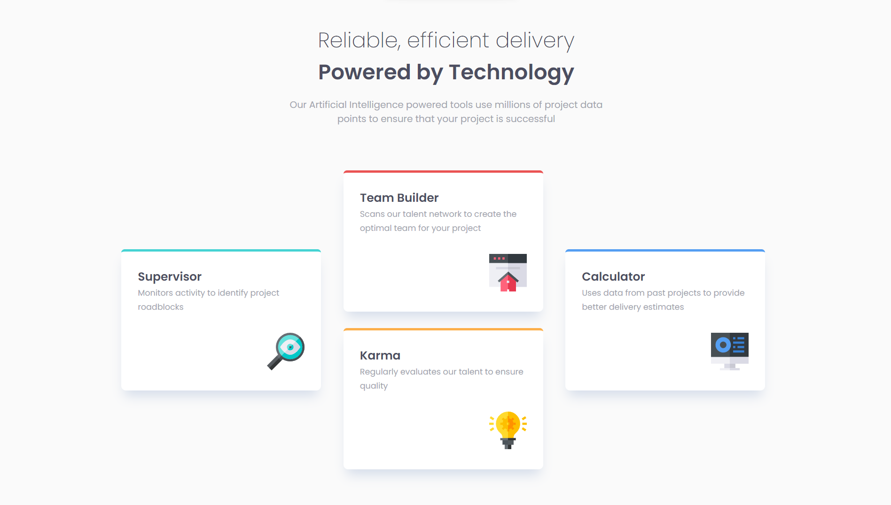

# Frontend Mentor - Four card feature section solution

This is a solution to the [Four card feature section challenge on Frontend Mentor](https://www.frontendmentor.io/challenges/four-card-feature-section-weK1eFYK). Frontend Mentor challenges help you improve your coding skills by building realistic projects.

## Table of contents

- [Overview](#overview)
  - [The challenge](#the-challenge)
  - [Screenshot](#screenshot)
  - [Links](#links)
- [My process](#my-process)
  - [Built with](#built-with)
  - [What I learned](#what-i-learned)
- [Author](#author)

## Overview

### The challenge

Users should be able to:

- View the optimal layout for the site depending on their device's screen size

### Screenshot



### Links

- Solution URL: [Frontend Mentor](https://www.frontendmentor.io/solutions/4-card-section-using-flexbox-and-grid-IgovjOWV9)
- Live Site URL: [GitHub Pages](https://valeriamontoya.github.io/4-card-feature-section/)

## My process

### Built with

- Semantic HTML5 markup
- CSS custom properties
- Flexbox
- CSS Grid
- Mobile-first workflow

### What I learned

The most interesting part was to build the layout needed for the cards. Even though I was able to code it, I'm not sure if that's the right way to do it, but it was an oportunity to practice Flexbox and Grid.  
You can see a bit of my CSS code below:

```css
.cards {
  display: grid;
  grid-template-columns: repeat(3, minmax(200px, 350px));
  grid-template-rows: repeat(2, 1fr);
  justify-content: center;
  gap: 28px;
}

.card {
  padding: 28px;
}

.card:first-of-type {
  grid-column: 1 / 2;
  grid-row: 1 / 3;
}

.card:nth-of-type(2) {
  grid-column: 2 / 3;
  grid-row: 1 / 2;
}

.card:nth-of-type(3) {
  grid-column: 2 / 3;
  grid-row: 2 / 3;
}

.card:last-of-type {
  grid-column: 3 / 4;
  grid-row: 1 / 3;
}
```

## Author

- Frontend Mentor - [@ValeriaMontoya](https://www.frontendmentor.io/profile/ValeriaMontoya)
- Twitter - [@vale_montoya\_](https://twitter.com/vale_montoya_)
